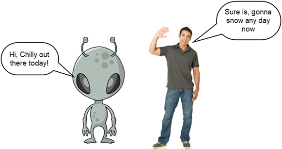

# Greetings #
{: .text-green-200 .text-center }

Upon first meeting a Earthlings, choose a **greeting** plus a **weather observation**.

 

## Greetings ##
{: .text-green-300 }

Choose one of the following:

|Time of Day    | Greeting         |
|---------------|------------------|
|Any time       | Hi, Hey, or Hello|            
|Before 12:00   | Good morning     |
|12:00 to 18:00 | Good afternoon   |
|Before 12:00   | Good evening     |

## Weather Obersation ##
{: .text-green-300 }
Earthlings, particularly humans, enjoy little more than discussing and complaining about the weather. Commenting on current or recent past conditions, positive or negative, is expected when casually conversing ("small talk"), and speculation about weather on upcoming days or seasons is an excellent way to initiaite a conversation. As such, you *must* become well-acquainted with the expected and unexpected weather patterns of the region you are visiting, and some of the expected responses to each.

### On a Sunny day ###
{: .text-grey-dk-000 }

|Months                 | Temperature       | Comment                    |
|-----------------------|-------------------|----------------------------|
|December to February   | Above 0           | Beautiful day today        |
|                       | -20 to 0          | Not a bad day out today    |
|                       | Below -20         | Chilly out there today     |
|March to April         | Above 10          | Beautiful day today        |
|                       | 0 to 10           | Not a bad day out today    |
|                       | Below 0           | Chilly out there today     |
|May, September       	| Above 18          | Beautiful day today        |
|                       | 10 to 18          | Not a bad day out today    |
|                       | Below 10          | Chilly out there today     |
|June to August         | Above 22          | Beautiful day today        |
|                       | 18 to 22          | Not a bad day out today    |
|                       | Below 18          | Chilly out there today     |
|October, November    	| Above 14          | Beautiful day today        |
|                       | 5 to 14           | Not a bad day out today    |
|                       | Below 5           | Chilly out there today     |

### On a Rainy day ###
{: .text-grey-dk-000 }

|Months                 | Comment|
|-----------------------|--------------------------------------------|
|April to August        | We needed that rain                        |
|October to November    | Guess summer is over                       |           
|December to March    	| Hope that water doesn't freeze on the roads|      

### On a Snowy Day ###   
{: .text-grey-dk-000 }

|Months                 | Comment|
|-----------------------|--------------------------------------|
|April to August        | Don't know why we live here          |
|October to November    | Did you see the snow!                |           
|December to March 	    | Had enough of the white stuff?       |
